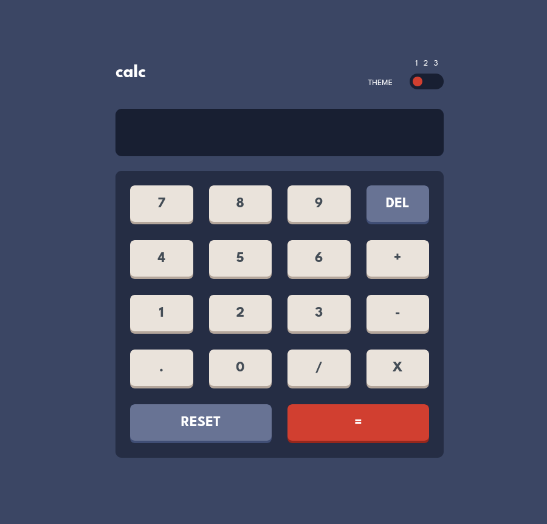

# Frontend Mentor - Calculator app solution

This is a solution to the [Calculator app challenge on Frontend Mentor](https://www.frontendmentor.io/challenges/calculator-app-9lteq5N29). Frontend Mentor challenges help you improve your coding skills by building realistic projects.

## Table of contents

- [Overview](#overview)
  - [The challenge](#the-challenge)
  - [Screenshot](#screenshot)
  - [Links](#links)
- [My process](#my-process)
  - [Built with](#built-with)
  - [What I learned](#what-i-learned)
  - [Continued development](#continued-development)
  - [Useful resources](#useful-resources)
- [Author](#author)

## Overview

### The challenge

Users should be able to:

- See the size of the elements adjust based on their device's screen size
- Perform mathmatical operations like addition, subtraction, multiplication, and division
- Adjust the color theme based on their preference
- **(Extra) Chain mathematical operations, ex: 1+1+1=3**
- **(Extra) Use keyboard keys to input numbers and operators**

### Screenshot

### Links

- Solution URL: [https://www.frontendmentor.io/solutions/calculator-app-with-react-typescript-and-react-testing-library-3x-gufRiIs](https://www.frontendmentor.io/solutions/calculator-app-with-react-typescript-and-react-testing-library-3x-gufRiIs)
- Live Site URL: [https://florianstancioiu.github.io/calculator-app/](https://florianstancioiu.github.io/calculator-app/)

## My process

### Built with

- Semantic HTML5 markup
- CSS custom properties
- Flexbox
- CSS Grid
- Mobile-first workflow
- [React](https://reactjs.org/) - JS library
- [TypeScript](https://www.typescriptlang.org/) - JavaScript superset
- [React Testing Library](https://testing-library.com/docs/react-testing-library/intro/) - For testing
- [TailwindCSS](https://tailwindcss.com/) - For styles
- [Vite](https://vite.dev/) - Build tool

### What I learned

I learned how to use the React Testing Library to create unit tests and how to mock/simulate existing functions in JavaScript (though, I haven't used mocking in this project).

### Continued development

1.  The calculator is not accessible to people that use only the keyboard to get around the application, I mean you can't use the tab key to move through the page.
2.  ~~When I started writing the calculator functionality I missed a couple of things, one of them is to handle negative numbers, right now you can't insert negative numbers, only positive ones.~~ - It is done
3.  ~~The other thing that I omited is the fact that you can't chain operations, so you can't do 2 x 2 x 2, you have to do 2 x 2 and then 4 x 2 to achieve the same thing.~~ It is done

### Useful resources

- ~~[Theming best practices in v4](https://github.com/tailwindlabs/tailwindcss/discussions/18471) - This taught me how to generate multiple themes in TailwindCSS 4~~ I ended up not using this, but the link is still useful
- [Spanning columns](https://tailwindcss.com/docs/grid-column#spanning-columns) - This taught me how to make a div take 2 columns in a grid, in TailwindCSS
- [Remove insignificant trailing zeros from a number?](https://stackoverflow.com/a/3613112/12159189) - Remove unneeded zeroes from the end of the number
- [Dealing with float precision in Javascript [duplicate]](https://stackoverflow.com/a/11695730/12159189) - Trim the number of point digits of a floating number
- [Capitalize text in TailwindCSS](https://tailwindcss.com/docs/text-transform) - Helped me turn `reset` text into `Reset` - capitalize
- [How can I convert a string into a math operator in javascript [duplicate]](https://stackoverflow.com/a/13077966/12159189) - This helped me (initially, I used a different approach in a later update) in achieving the functionality of the calculator, I initially wanted to implement it using the `eval` function
- [How do I chop/slice/trim off last character in string using Javascript?](https://stackoverflow.com/a/953274/12159189) - This helped me with the delete button
- [React - The Complete Guide 2025 (incl. Next.js, Redux) - Section 31: Testing React Apps (Unit Tests)](https://www.udemy.com/course/react-the-complete-guide-incl-redux) - This Udemy course by Maximilian Schwarzmüller helped me understand some concepts regarding React Testing Library
- [ByTestId](https://testing-library.com/docs/queries/bytestid/) - This helped me test various parts of the components using react testing library (mainly the Calculator component)
- [Trouble with Dynamic Color in Tailwind Component](https://stackoverflow.com/questions/76353036/trouble-with-dynamic-color-in-tailwind-component) - This helped me understand how to write dynamic colors in React so that Tailwind can process them
- [Test React component method is calling function pass as a prop](https://stackoverflow.com/questions/45867095/test-react-component-method-is-calling-function-pass-as-a-prop) - This helped me test a function passed as a prop in React
- [Evaluating a string as a mathematical expression in JavaScript](https://stackoverflow.com/a/62402481/12159189) - Evaluate a string as a mathematical operation in JS

## Author

- Frontend Mentor - [@florianstancioiu](https://www.frontendmentor.io/profile/florianstancioiu)
- Threads - [@florianstancioiu01](https://www.threads.com/@florianstancioiu01)
- LinkedIn - [florianstancioiu](https://www.linkedin.com/in/florian-stancioiu-765661349/)
- freeCodeCamp - [florianstancioiu](https://www.freecodecamp.org/florianstancioiu)
